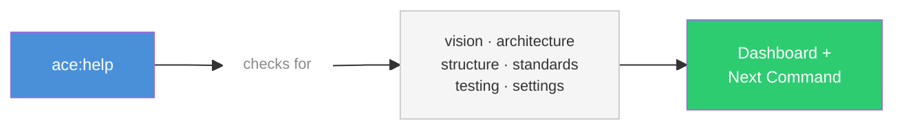
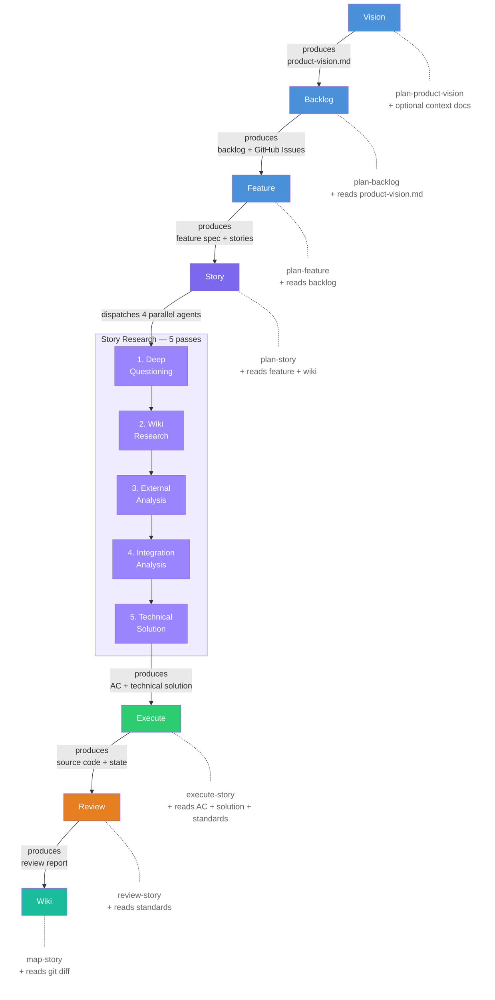

# ACE — Agile Context Engineering

[](https://www.npmjs.com/package/agile-context-engineering)
[](LICENSE)
[](https://nodejs.org)

**Spec-driven development for AI coding assistants.**

ACE turns your AI coding assistant into a full agile team — product owner, architect, code reviewer, and more — working from crystal-clear specs instead of vague prompts. Every story gets deep research, multi-agent execution, automated code review, and living documentation that grows with your project.

---

## Why ACE?

If you've been part of software development in any capacity in the last 10-15 years, you've probably heard of Agile. If so — ACE is for you. It brings the full agile workflow to AI-assisted development: structured planning, incremental delivery, and living documentation, all managed by specialized AI agents.

If not, here's the TLDR — Agile breaks work down into manageable pieces:

```
Product Vision        The north star — what you're building and why
  └── Backlog         Epics and features organized by priority
       └── Feature    A deliverable capability (1-2 sprints)
            └── Story A user-facing work item with clear acceptance criteria (1-3 days)
```

You start with a vision, break it into a backlog of epics and features, decompose features into stories, then execute stories one by one. Each story is small enough to reason about clearly, but connected to the bigger picture through the hierarchy above it.

**What makes ACE different:**
- **Spec-driven** — Stories have crystal-clear acceptance criteria with zero assumptions. Every story goes through 5 research passes before a single line of code is written
- **Multi-agent** — 8 specialized agents (Product Owner, Architect, Code Reviewer, Wiki Mapper, etc.) work in parallel. For larger stories, ACE leverages Claude Code's [Agent Teams](https://code.claude.com/docs/en/agent-teams) — unlike regular subagents that silently do work and report back, Agent Teams are fully independent Claude Code sessions that share a task list, message each other directly, coordinate on shared interfaces, and self-organize. ACE decomposes the technical solution into independent work streams, assigns each to a teammate with owned files, and adds a dedicated reviewer teammate that monitors code quality in real-time. The lead coordinates, approves each teammate's plan before they start implementing, and integrates the results
- **GitHub Project management** — On top of generating local artifacts, ACE can optionally sync with GitHub — creating issues for epics, features, and stories, tracking status on project boards, and updating labels as work progresses through the pipeline
- **Living wiki** — ACE maps all your code into a project wiki and updates it after every story, so the AI always has architectural overview context when planning new work
- **Purpose-built CLI tooling** — A dedicated CLI (`ace-tools`) offloads infrastructure work outside the AI's context window — environment detection, markdown parsing, path computation, model resolution, state updates, and GitHub GraphQL operations all return structured JSON in a single call, saving tokens and avoiding shell escaping issues

---

## How It Works

### Getting Started — `/ace:help`

Run `/ace:help` at any point to see what's set up and what to do next. It checks for six foundation documents: **product vision**, **system architecture**, **system structure**, **coding standards**, **testing framework**, and **settings**. These documents are generated by the foundation commands (`plan-product-vision`, `map-system`, `init-coding-standards`) and are used by all subsequent planning and execution commands to stay aligned with your project's architecture, conventions, and goals.



### Full Lifecycle



---

## Installation

ACE supports [Claude Code](https://docs.anthropic.com/en/docs/claude-code) and [Crush](https://github.com/crushai/crush) (formerly [OpenCode](https://github.com/opencode-ai/opencode)) as runtimes.

> **Note:** ACE has been primarily developed and tested with Claude Code. Crush support is functional (the installer transforms all paths automatically), but has not been thoroughly tested end-to-end. If you encounter issues running ACE in Crush, please [open an issue](https://github.com/agile-context-engineering/ace/issues).

```bash
npx agile-context-engineering
```

This launches an interactive installer. You can also use flags for non-interactive install:

```bash
npx agile-context-engineering --claude --global   # Claude Code, global install
npx agile-context-engineering --claude --local    # Claude Code, local (project-only)
npx agile-context-engineering --opencode --global # Crush (formerly OpenCode), global install
npx agile-context-engineering --all --global      # All runtimes, global install
```

### Updating

When a new version is available, your status bar will show a yellow `/ace:update` indicator. Run the `/ace:update` command inside Claude Code to update — it detects your install type (global/local, Claude/Crush) automatically and runs the correct installer.

### Prerequisites

| Requirement | Purpose |
|---|---|
| [Node.js](https://nodejs.org) >= 16.7.0 | Runs the installer and CLI tools |
| [Claude Code](https://docs.anthropic.com/en/docs/claude-code) or [Crush](https://github.com/crushai/crush) / [OpenCode](https://github.com/opencode-ai/opencode) | AI coding assistant runtime |
| [GitHub CLI (`gh`)](https://cli.github.com/) | Required for GitHub issue tracking and project board integration |

---

## Quick Start

Run `/ace:help` first. It will show you which foundation documents are missing and suggest the exact command to generate each one. Follow its suggestions until the dashboard shows everything complete.

Once the dashboard is fully green, you're ready to build:

```
/ace:plan-backlog            # Create epics and features from your vision
/ace:plan-feature            # Break a feature into stories
/ace:plan-story              # Deep-plan a story (triggers 5 research passes)
/ace:execute-story           # Execute with multi-agent teams
```

---


## Key Features

### Agent Teams

ACE can leverage Claude Code's [Agent Teams](https://code.claude.com/docs/en/agent-teams) for story execution. As opposed to regular subagents — which silently do work in isolation and report results back — Agent Teams are fully independent Claude Code sessions that:

- **Share a task list** — teammates claim tasks, mark them complete, and blocked tasks auto-unblock when dependencies resolve
- **Message each other directly** — teammates coordinate on shared interfaces, ask questions, and challenge each other's approaches without going through the lead
- **Each have their own context window** — no shared context limit; each teammate gets a fresh 200k window
- **Require plan approval** — the lead reviews and approves each teammate's implementation plan before they start writing code
- **Self-organize** — after finishing a task, teammates pick up the next available one on their own

ACE orchestrates this by decomposing the technical solution into independent work streams (e.g., "state-layer", "ui-layer", "integration", "tests"), assigning each to a teammate with explicitly owned files (no overlap), and spawning a dedicated reviewer teammate that watches for anti-patterns, coding standards violations, and dead code as other teammates work.

### 8 Specialized Agents

| Agent | Role |
|---|---|
| **Product Owner** | Requirements gathering, decomposition, prioritization, estimation, backlog management |
| **Technical Architect** | Solution design, architecture decisions, Clean Architecture and SOLID enforcement |
| **Code Discovery Analyst** | Deep repository analysis — extracts patterns, algorithms, data models, architectural decisions |
| **Code Integration Analyst** | Analyzes how new features integrate while maintaining architecture and extensibility |
| **Code Reviewer** | Completeness, correctness, code quality, anti-pattern detection, tech debt discovery |
| **Wiki Mapper** | Writes structured wiki documents for the engineering knowledge base |
| **Project Researcher** | Researches domain ecosystem to inform planning phases |
| **Research Synthesizer** | Synthesizes outputs from parallel research agents into coherent summaries |

### ACE CLI Tooling (`ace-tools`)

The AI doesn't do everything itself. ACE offloads infrastructure-heavy operations to a purpose-built Node.js CLI, keeping workflows fast and token-efficient:

- **Compound init commands** — Each workflow starts with a single `init` call that gathers 15-20 environment facts: brownfield detection, model resolution, story parsing, metadata extraction, path computation, and file existence checks — all returned as structured JSON
- **Atomic state updates** — One command updates the story file, feature file, and product backlog together, with cascading logic that auto-promotes feature status when all stories complete
- **GitHub operations** — Issue creation, type assignment, project board placement, field updates, and parent linking happen in one call. Markdown bodies use `--body-file` to avoid shell escaping issues with code blocks and backticks
- **Bulk sync** — Pushes local story/feature content to GitHub issues and syncs project board status in a single command
- **Markdown parsing** — Story headers, metadata fields, acceptance criteria, requirements sections, and wiki references are extracted and categorized outside the context window
- **Environment detection** — Brownfield detection walks the directory tree checking 10+ code file extensions and package files, reused across every workflow

### GitHub Integration

ACE works fully offline with local artifacts. Optionally, you can enable GitHub integration to sync epics, features, and stories as GitHub issues — with automatic status tracking, labels, and project board updates as work progresses through the pipeline.

Requires the [GitHub CLI (`gh`)](https://cli.github.com/) to be installed and authenticated.


## Project Structure

ACE creates two directories in your project:

**`.ace/`** — Internal artifacts that ACE needs to operate: configuration, feature specs, story specs, research outputs, and supporting documents. This is ACE's working directory and can be safely `.gitignore`d if you prefer to keep your repo clean.

**`.docs/`** — Project-facing documents: the living wiki, product vision, and coding standards. These are meant to be committed — they provide valuable context for your team and for the AI across sessions.

```
.ace/
├── config.json           # ACE configuration (GitHub org, project, settings)
├── backlog/              # Epics and features
│   ├── E1-epic-name.md
│   └── E1/
│       └── F1-feature-name.md
└── stories/              # Story specs and research artifacts

.docs/
├── wiki/                 # Living engineering knowledge base
│   ├── system-wide/      # System-level architecture docs
│   └── subsystems/       # Per-subsystem documentation
├── product-vision.md     # Product vision document
└── coding-standards.md   # Project coding standards
```

## Living Wiki

Every completed story triggers a wiki update. The wiki is the AI's institutional memory of your codebase — it's what allows agents to make informed decisions about where to put code, which patterns to follow, and how to wire new components into existing infrastructure.

**System-wide docs** (`.docs/wiki/system-wide/`) provide the 30,000-foot view:

| Document | What it captures |
|---|---|
| **system-structure.md** | Physical directory layout, every subsystem and its purpose, where each code file lives and what it does |
| **system-architecture.md** | C4 diagrams, subsystem responsibility matrix, core data flows, tech stack |
| **testing-framework.md** | Test frameworks, patterns, mocking strategies, coverage approach |
| **coding-standards.md** | Language and framework conventions |
| **tech-debt-index.md** | All known tech debt across subsystems, tracked by severity |

**Subsystem docs** (`.docs/wiki/subsystems/[name]/`) go deep into each subsystem:

| Folder | What it documents | How the AI uses it |
|---|---|---|
| **structure.md** | File tree, directory purposes, key file locations, where to add new code | Knows exactly where every file is and what it does |
| **architecture.md** | Architectural pattern (Clean/N-Tier/CQRS), C4 L3 components, internal flows, dependency inventory | Understands the subsystem's internal design before making changes |
| **systems/** | Domain components — file trees, entry points, data flows, sequence diagrams, state management, error propagation | Understands what exists before adding new code |
| **patterns/** | Reusable structural templates — structure diagrams, current implementations, how to apply | Follows existing patterns instead of inventing new ones |
| **cross-cutting/** | Shared infrastructure — DI containers, event systems, factories, registrations | Knows exactly where to register new components |
| **guides/** | Step-by-step recipes for common tasks (e.g., "add a new API endpoint") | Follows proven procedures instead of guessing |
| **decisions/** | Architecture Decision Records — why choices were made, alternatives rejected | Respects past decisions, doesn't re-litigate them |

When planning a new story, the wiki research pass scans all relevant docs and attaches them to the story. When executing, the agent loads those references as context. After implementation, `map-story` updates the wiki with what changed — so the next story benefits from everything learned.

## Commands

### Getting Started

| Command | Description |
|---|---|
| `/ace:help` | Check project initialization status and suggest next steps |

### Foundation (one-time setup)

| Command | Description |
|---|---|
| `/ace:plan-product-vision` | Create or update the product vision through architecture-aware questioning |
| `/ace:init-coding-standards` | Generate a tailored `coding-standards.md` through codebase detection and user interview |
| `/ace:map-system` | Map system-wide structure, architecture, and testing framework into `.docs/wiki/system-wide/` |
| `/ace:map-subsystem` | Map a subsystem's structure, architecture, and knowledge docs into `.docs/wiki/subsystems/[name]/` |

### Planning

| Command | Description |
|---|---|
| `/ace:plan-backlog` | Create or refine the product backlog through vision-aware questioning and guided epic/feature planning |
| `/ace:plan-feature` | Plan a feature through backlog-aware questioning, story decomposition, and guided specification |

### Story Refinement

| Command | Description |
|---|---|
| `/ace:plan-story` | Plan a story with crystal-clear acceptance criteria, then auto-dispatch 5 research passes |

`/ace:plan-story` is where ACE really shines. After establishing acceptance criteria through deep questioning, it automatically dispatches up to 4 parallel research agents:

1. **Deep questioning** — Collaborative refinement to eliminate all assumptions from acceptance criteria
2. **Wiki research** — Searches the living wiki for relevant architectural context *(auto-dispatched)*
3. **External analysis** — Studies similar implementations in reference repositories *(optional, auto-dispatched)*
4. **Integration analysis** — Analyzes how the story integrates into the existing codebase *(auto-dispatched)*
5. **Technical solution** — Designs the architecture, patterns, algorithms, and implementation plan *(auto-dispatched)*

Each research pass can also be run standalone:

| Command | Description |
|---|---|
| `/ace:research-story-wiki` | Research and curate wiki references relevant to a story |
| `/ace:research-external-solution` | Code-level analysis of similar implementations in external repositories |
| `/ace:research-integration-solution` | System integration analysis for fitting a story into the existing codebase |
| `/ace:research-technical-solution` | Technical solution design — architecture, patterns, sequence diagrams, implementation plan |

### Execution & Review

| Command | Description |
|---|---|
| `/ace:execute-story` | Execute a fully-planned story — implements via solo or agent teams, runs code review, updates state, triggers wiki mapping |
| `/ace:review-story` | Standalone code review — artifact verification, anti-pattern detection, coding standards enforcement, tech debt discovery |

### Documentation

| Command | Description |
|---|---|
| `/ace:map-story` | Update living knowledge docs after story implementation or for existing undocumented code |

---

## Acknowledgements

Portions of this project were adapted from [GSD (Get Shit Done)](https://github.com/coleam00/get-shit-done) by Lex Christopherson, licensed under the MIT License.

## License

[MIT](LICENSE)
